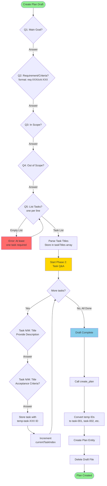
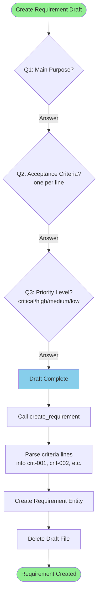
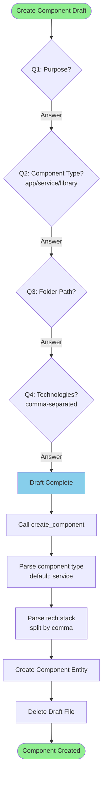
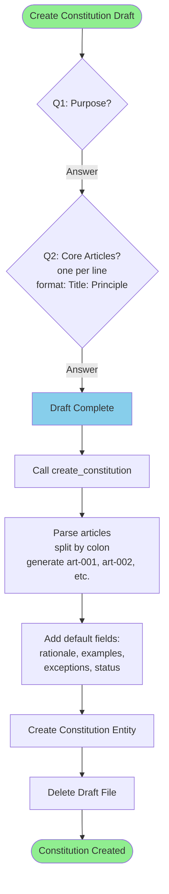
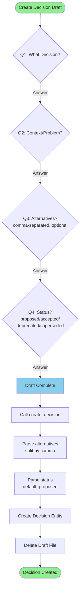
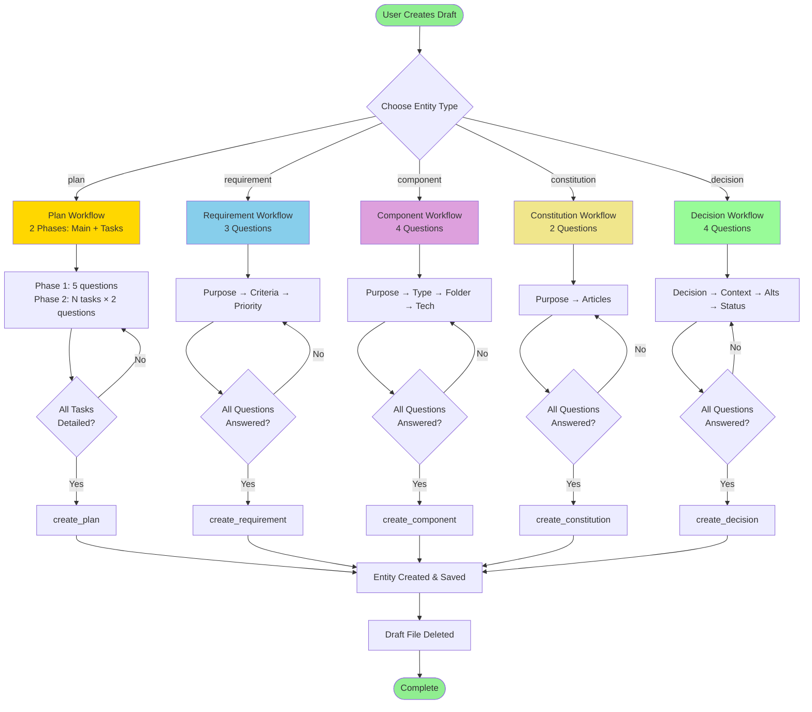
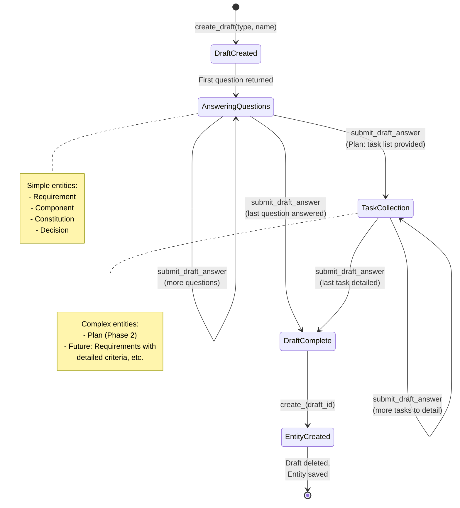
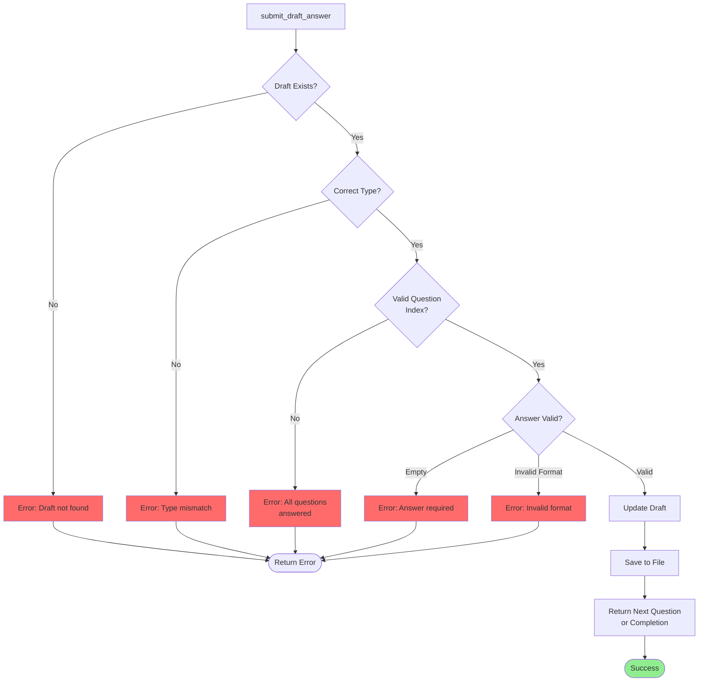
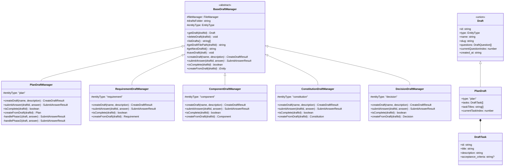
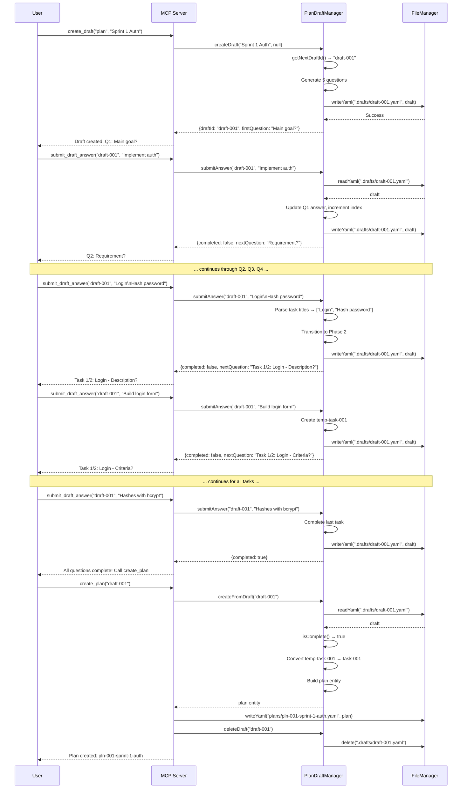

# Draft Workflows - Complete Flow Charts

## Overview

This document contains detailed Mermaid flow charts for all entity type draft workflows.

---

## 1. Plan Draft Workflow (Two-Phase)



---

## 2. Requirement Draft Workflow (Simple Linear)



---

## 3. Component Draft Workflow (Simple Linear)



---

## 4. Constitution Draft Workflow (Simple Linear)



---

## 5. Decision Draft Workflow (Simple Linear)



---

## Combined Overview: All Entity Types



---

## Detailed Question Reference

### Plan (2-Phase Workflow)

**Phase 1: Main Questions (5)**
| # | Question | Format | Example |
|---|----------|--------|---------|
| 1 | What is the main goal of this plan? | Free text | "Implement user authentication" |
| 2 | Which requirement and criteria does this plan fulfill? | `req-XXX-slug/crit-XXX` | "req-001-user-auth/crit-001" |
| 3 | What is in scope for this plan? | Free text | "Login, registration, password reset" |
| 4 | What is explicitly out of scope? | Free text | "OAuth, social login" |
| 5 | List the tasks you want to add | One per line | "Login form\nPassword hashing\nSession management" |

**Phase 2: Task Questions (2 per task)**
| # | Question | Format | Example |
|---|----------|--------|---------|
| 1 | Task N/M: "Title" - Provide a detailed description | Free text | "Build a React login form with email and password fields" |
| 2 | Task N/M: "Title" - What are the acceptance criteria? | Free text | "Form validates email format, shows error messages" |

---

### Requirement (Linear Workflow)

| # | Question | Format | Example |
|---|----------|--------|---------|
| 1 | What is the main purpose of this requirement? | Free text | "Allow users to log in securely" |
| 2 | What are the acceptance criteria? | One per line | "User can login\nPassword is hashed\nSession expires" |
| 3 | What is the priority level? | critical/high/medium/low/nice-to-have | "high" |

---

### Component (Linear Workflow)

| # | Question | Format | Example |
|---|----------|--------|---------|
| 1 | What is the purpose of this component? | Free text | "Authentication service for user login" |
| 2 | What type of component is this? | app/service/library | "service" |
| 3 | What is the folder path for this component? | Path | "packages/auth" |
| 4 | What technologies does this component use? | Comma-separated | "Node.js, Express, Passport, JWT" |

---

### Constitution (Linear Workflow)

| # | Question | Format | Example |
|---|----------|--------|---------|
| 1 | What is the purpose of this constitution? | Free text | "Define code quality standards" |
| 2 | What are the core articles/principles? | One per line: `Title: Principle` | "Code Review: All PRs require review\nTesting: 80% coverage minimum" |

---

### Decision (Linear Workflow)

| # | Question | Format | Example |
|---|----------|--------|---------|
| 1 | What decision is being made? | Free text | "Use PostgreSQL for database" |
| 2 | What is the context or problem that prompted this decision? | Free text | "Need reliable relational database with good scaling" |
| 3 | What alternatives were considered? | Comma-separated | "MongoDB, MySQL, SQLite" |
| 4 | What is the status? | proposed/accepted/deprecated/superseded | "accepted" |

---

## State Machine Diagram



---

## Draft File Structure Examples

### Plan Draft (During Phase 2)

```yaml
id: draft-001
type: plan
name: Sprint 1 Authentication
slug: sprint-1-authentication
questions:
  - question: What is the main goal of this plan?
    answer: Implement user authentication
  - question: Which requirement and criteria does this plan fulfill?
    answer: req-001-user-auth/crit-001
  - question: What is in scope for this plan?
    answer: Login, registration, password reset
  - question: What is explicitly out of scope?
    answer: OAuth, social login
  - question: List the tasks you want to add
    answer: |
      Login form
      Password hashing
      Session management
currentQuestionIndex: 5
tasks:
  - id: temp-task-001
    title: Login form
    description: Build a React login form with email and password fields
    acceptance_criteria: Form validates email format, shows error messages
  - id: temp-task-002
    title: Password hashing
    description: Use bcrypt to hash passwords before storage
    acceptance_criteria: null  # Currently being asked
taskTitles:
  - Login form
  - Password hashing
  - Session management
currentTaskIndex: 1
created_at: '2025-10-09T12:00:00Z'
```

### Requirement Draft (Simple)

```yaml
id: draft-002
type: requirement
name: User Authentication
slug: user-authentication
questions:
  - question: What is the main purpose of this requirement?
    answer: Allow users to log in securely
  - question: What are the acceptance criteria?
    answer: |
      User can login with email/password
      Password is hashed with bcrypt
      Session expires after 24 hours
  - question: What is the priority level?
    answer: high
currentQuestionIndex: 3
created_at: '2025-10-09T12:00:00Z'
```

---

## Workflow Comparison Table

| Entity Type | Total Questions | Phases | Collections | Complexity |
|-------------|----------------|--------|-------------|------------|
| **Plan** | 5 + (N tasks × 2) | 2 | tasks, taskTitles | High |
| **Requirement** | 3 | 1 | - | Low |
| **Component** | 4 | 1 | - | Low |
| **Constitution** | 2 | 1 | - | Low |
| **Decision** | 4 | 1 | - | Low |

---

## Error Handling Flows



---

## Implementation Architecture



---

## MCP Tool Call Sequences

### Create a Plan (Complete Example)



---

This comprehensive documentation provides complete visibility into all draft workflows and their implementation details.
