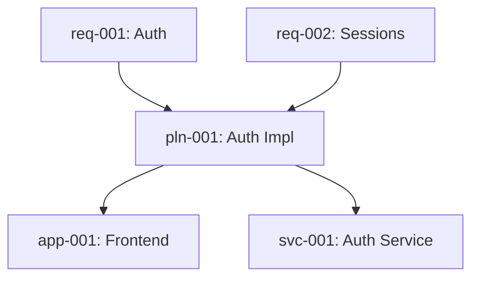

# High-ROI MCP Tool Implementation Plans

Detailed implementation plans for the 5 highest-value MCP tools.

---

## 1. analyze-dependencies

**Purpose:** Provide comprehensive dependency analysis for any entity in the spec system.

### Functionality

**Core Features:**
- Map all direct and transitive dependencies
- Show dependency tree with configurable depth
- Identify critical path dependencies
- Calculate dependency metrics (fan-in, fan-out)
- Detect dependency health issues

**Input Schema:**
```typescript
{
  entity_id?: string,        // "req-001-auth" or "pln-001-api" or "app-001-frontend"
  type?: "requirement" | "plan" | "component" | "all",
  depth?: number,            // 1-10, default: unlimited
  direction?: "upstream" | "downstream" | "both",  // default: "both"
  include_metrics?: boolean, // default: true
  format?: "tree" | "flat" | "graph"  // default: "tree"
}
```

**Output Schema:**
```typescript
{
  success: true,
  data: {
    entity: {
      id: "pln-001-auth",
      type: "plan",
      name: "Authentication Implementation"
    },

    // Upstream dependencies (what this depends on)
    upstream: {
      direct: [
        {
          id: "req-001-auth",
          type: "requirement",
          name: "User Authentication",
          relationship: "implements",
          critical: true
        }
      ],
      transitive: [
        {
          id: "req-002-session",
          type: "requirement",
          name: "Session Management",
          path: ["req-001-auth", "req-002-session"],
          depth: 2
        }
      ],
      total_count: 5
    },

    // Downstream dependencies (what depends on this)
    downstream: {
      direct: [
        {
          id: "app-001-frontend",
          type: "component",
          name: "Frontend Application",
          relationship: "uses",
          critical: false
        }
      ],
      transitive: [],
      total_count: 3
    },

    // Dependency metrics
    metrics: {
      fan_in: 3,              // Number of entities depending on this
      fan_out: 5,             // Number of entities this depends on
      depth_upstream: 3,      // Max depth of upstream dependencies
      depth_downstream: 2,    // Max depth of downstream dependencies
      coupling_score: 0.65,   // 0-1, higher = more coupled
      stability: 0.45,        // fan_out / (fan_in + fan_out)
      criticality: "high"     // Based on fan_in and critical paths
    },

    // Dependency tree (hierarchical view)
    tree: {
      root: "pln-001-auth",
      upstream: [
        {
          id: "req-001-auth",
          children: [
            { id: "req-002-session", children: [] }
          ]
        }
      ],
      downstream: [
        {
          id: "app-001-frontend",
          children: [
            { id: "lib-001-ui", children: [] }
          ]
        }
      ]
    },

    // Issues detected
    issues: [
      {
        type: "high_coupling",
        severity: "warning",
        message: "This plan has high coupling (fan_out: 5)",
        suggestion: "Consider breaking down into smaller plans"
      },
      {
        type: "circular_risk",
        severity: "info",
        message: "Close to forming circular dependency with pln-002",
        suggestion: "Review dependency structure"
      }
    ]
  }
}
```

**Implementation Steps:**
1. Query SpecsManager for entity
2. Use DependencyAnalyzer to build dependency graph
3. Calculate metrics (fan-in, fan-out, coupling)
4. Traverse graph in both directions with depth limit
5. Detect issues (high coupling, circular risks)
6. Format output based on requested format

**Use Cases:**
- "What does this requirement depend on?"
- "What would break if I change this component?"
- "Show me the full dependency chain"
- "Which entities are most tightly coupled?"
- "What's the critical path through this feature?"

---

## 2. analyze-coverage

**Purpose:** Analyze test coverage and implementation status across the spec system.

### Functionality

**Core Features:**
- Calculate coverage metrics for requirements
- Track implementation status of plans
- Identify untested/unimplemented areas
- Generate coverage reports by priority/type
- Show coverage trends

**Input Schema:**
```typescript
{
  entity_type?: "requirement" | "plan" | "all",  // default: "all"
  entity_id?: string,         // Analyze specific entity
  priority?: "critical" | "required" | "ideal" | "optional",
  include_details?: boolean,  // default: false
  group_by?: "priority" | "type" | "status"  // default: "priority"
}
```

**Output Schema:**
```typescript
{
  success: true,
  data: {
    summary: {
      total_requirements: 45,
      requirements_with_plans: 38,
      requirements_without_plans: 7,
      total_plans: 52,
      plans_completed: 23,
      plans_in_progress: 18,
      plans_not_started: 11,

      // Overall metrics
      overall_coverage: 0.844,  // 84.4%
      implementation_rate: 0.442, // 44.2% of plans completed

      // By priority
      by_priority: {
        critical: {
          total: 8,
          covered: 8,
          completed: 6,
          coverage: 1.0,
          completion: 0.75
        },
        required: {
          total: 22,
          covered: 20,
          completed: 12,
          coverage: 0.909,
          completion: 0.545
        },
        ideal: {
          total: 10,
          covered: 7,
          completed: 4,
          coverage: 0.7,
          completion: 0.4
        },
        optional: {
          total: 5,
          covered: 3,
          completed: 1,
          coverage: 0.6,
          completion: 0.2
        }
      }
    },

    // Detailed breakdown (if include_details: true)
    details: {
      uncovered_requirements: [
        {
          id: "req-007-notifications",
          name: "Push Notifications",
          priority: "ideal",
          reason: "no_plan",
          suggestion: "Create implementation plan"
        },
        {
          id: "req-012-analytics",
          name: "Analytics Dashboard",
          priority: "optional",
          reason: "no_plan"
        }
      ],

      incomplete_plans: [
        {
          id: "pln-003-auth",
          name: "Authentication Implementation",
          requirement_id: "req-001-auth",
          status: "in_progress",
          progress: 0.65,  // 65% of tasks completed
          blocking_tasks: [
            {
              id: "task-003",
              description: "Implement OAuth integration",
              priority: "high"
            }
          ]
        }
      ],

      untested_features: [
        {
          plan_id: "pln-008-payment",
          name: "Payment Processing",
          test_cases: 0,
          critical: true,
          suggestion: "Add test cases for critical payment flows"
        }
      ]
    },

    // Coverage gaps
    gaps: [
      {
        type: "missing_plan",
        severity: "high",
        entity_id: "req-001-auth",
        entity_name: "User Authentication",
        priority: "critical",
        message: "Critical requirement has no implementation plan",
        action: "Create plan for req-001-auth"
      },
      {
        type: "insufficient_testing",
        severity: "medium",
        entity_id: "pln-005-api",
        entity_name: "API Endpoints",
        message: "Plan has only 2 test cases for 15 endpoints",
        action: "Add test cases to achieve 80% coverage"
      }
    ],

    // Recommendations
    recommendations: [
      "Focus on covering 7 requirements without plans",
      "Complete 11 not-started plans to improve implementation rate",
      "Add test cases to 8 plans with insufficient testing",
      "Prioritize critical requirements with 75% completion"
    ]
  }
}
```

**Implementation Steps:**
1. Query all requirements and plans from SpecsManager
2. Use CoverageAnalyzer to calculate metrics
3. Group by requested dimension (priority/type/status)
4. Identify gaps (uncovered, incomplete, untested)
5. Generate recommendations based on gaps
6. Format detailed breakdown if requested

**Use Cases:**
- "What's our overall test coverage?"
- "Which critical requirements aren't implemented?"
- "Show me all incomplete plans"
- "What should we focus on next?"
- "Generate a coverage report for stakeholders"

---

## 3. validate-references

**Purpose:** Validate all cross-references between entities and suggest fixes.

### Functionality

**Core Features:**
- Validate all cross-references exist
- Check for broken references
- Detect circular dependencies
- Suggest fixes for broken references
- Batch validation with detailed results

**Input Schema:**
```typescript
{
  entity_id?: string,         // Validate specific entity
  type?: "requirement" | "plan" | "component" | "all",
  fix_suggestions?: boolean,  // default: true
  auto_fix?: boolean,         // default: false (future)
  check_orphans?: boolean,    // default: true
  check_cycles?: boolean      // default: true
}
```

**Output Schema:**
```typescript
{
  success: true,
  data: {
    summary: {
      total_entities: 105,
      validated: 105,
      valid: 92,
      invalid: 13,
      warnings: 8
    },

    // Validation results
    results: [
      {
        entity_id: "req-001-auth",
        entity_type: "requirement",
        entity_name: "User Authentication",
        valid: false,

        errors: [
          {
            type: "missing_reference",
            severity: "error",
            field: "criteria[0].plan_id",
            value: "pln-999-missing",
            message: "References non-existent plan 'pln-999-missing'",

            // Fix suggestions
            suggestions: [
              {
                action: "replace",
                with: "pln-001-auth-impl",
                confidence: 0.95,
                reason: "Similar name: 'Authentication Implementation'"
              },
              {
                action: "replace",
                with: "pln-003-oauth",
                confidence: 0.78,
                reason: "Related to authentication"
              },
              {
                action: "remove",
                reason: "Remove broken reference"
              }
            ]
          }
        ],

        warnings: [
          {
            type: "orphan",
            severity: "warning",
            message: "This requirement is not referenced by any other entity",
            suggestion: "Consider linking to related plans or marking as deprecated"
          }
        ]
      },

      {
        entity_id: "pln-005-api",
        entity_type: "plan",
        entity_name: "API Implementation",
        valid: false,

        errors: [
          {
            type: "circular_dependency",
            severity: "error",
            field: "depends_on",
            cycle: ["pln-005-api", "pln-012-auth", "pln-015-session", "pln-005-api"],
            message: "Circular dependency detected",

            suggestions: [
              {
                action: "break_cycle",
                remove: "pln-015-session",
                from: "depends_on",
                reason: "Break cycle at weakest dependency"
              },
              {
                action: "restructure",
                reason: "Consider extracting shared components"
              }
            ]
          }
        ]
      },

      {
        entity_id: "app-001-frontend",
        entity_type: "component",
        entity_name: "Frontend Application",
        valid: true,

        warnings: [
          {
            type: "high_coupling",
            severity: "info",
            message: "Depends on 12 other components",
            suggestion: "Consider facade pattern to reduce coupling"
          }
        ]
      }
    ],

    // Issues by type
    issues_by_type: {
      missing_reference: 8,
      circular_dependency: 3,
      orphan: 5,
      high_coupling: 2
    },

    // Quick fixes (if auto_fix: true in future)
    quick_fixes: [
      {
        entity_id: "req-001-auth",
        field: "criteria[0].plan_id",
        current: "pln-999-missing",
        proposed: "pln-001-auth-impl",
        confidence: 0.95,
        safe: true
      }
    ],

    // Overall assessment
    assessment: {
      health: "needs_attention",  // healthy | needs_attention | critical
      critical_issues: 3,
      actionable_fixes: 11,
      estimated_fix_time: "2 hours"
    }
  }
}
```

**Implementation Steps:**
1. Use ReferenceValidator to validate entities
2. Collect all validation errors and warnings
3. For each broken reference, find similar valid references
4. Calculate confidence scores using string similarity
5. Detect circular dependencies using cycle detection
6. Check for orphaned entities
7. Group and categorize issues
8. Generate fix suggestions with confidence scores

**Use Cases:**
- "Are all my references valid?"
- "Find all broken links in the spec system"
- "What needs to be fixed before deployment?"
- "Suggest fixes for validation errors"
- "Health check before major changes"

---

## 4. search-specs

**Purpose:** Advanced search across all specification entities with fuzzy matching.

### Functionality

**Core Features:**
- Full-text search across all fields
- Fuzzy matching for typos
- Field-specific searches
- Boolean operators (AND, OR, NOT)
- Regex support
- Sorting and ranking by relevance

**Input Schema:**
```typescript
{
  query: string,              // "authentication AND security"
  types?: ["requirement", "plan", "component"],  // default: all
  fields?: ["name", "description", "criteria"],  // default: all searchable
  fuzzy?: boolean,            // default: true
  case_sensitive?: boolean,   // default: false
  regex?: boolean,            // default: false
  limit?: number,             // default: 50
  offset?: number,            // default: 0
  sort_by?: "relevance" | "created" | "updated" | "priority",
  filters?: {
    priority?: "critical" | "required" | "ideal" | "optional",
    status?: "completed" | "in_progress" | "not_started",
    created_after?: "2024-01-01",
    created_before?: "2024-12-31",
    has_dependencies?: boolean,
    has_tests?: boolean
  }
}
```

**Output Schema:**
```typescript
{
  success: true,
  data: {
    query: "authentication security",
    total_results: 23,
    page: 1,
    per_page: 50,

    results: [
      {
        id: "req-001-auth",
        type: "requirement",
        name: "User Authentication",
        description: "Implement secure user authentication system...",

        // Matching info
        score: 0.95,            // Relevance score 0-1
        matches: [
          {
            field: "name",
            value: "User Authentication",
            highlights: ["<mark>Authentication</mark>"]
          },
          {
            field: "description",
            value: "Implement secure user authentication system...",
            highlights: [
              "Implement <mark>secure</mark> user <mark>authentication</mark>",
              "<mark>Security</mark> requirements include..."
            ]
          }
        ],

        // Context
        priority: "critical",
        created_at: "2024-01-15",
        updated_at: "2024-02-20",

        // Related info
        related: {
          plans: 2,
          components: 3,
          dependencies: 1
        }
      },

      {
        id: "pln-003-oauth",
        type: "plan",
        name: "OAuth Integration",
        description: "Integrate OAuth 2.0 for third-party authentication",

        score: 0.87,
        matches: [
          {
            field: "description",
            value: "Integrate OAuth 2.0 for third-party authentication",
            highlights: ["third-party <mark>authentication</mark>"]
          },
          {
            field: "tasks[2].description",
            value: "Implement security headers",
            highlights: ["<mark>security</mark> headers"]
          }
        ],

        priority: "high",
        status: "in_progress",
        progress: 0.6
      },

      {
        id: "app-002-auth-service",
        type: "component",
        name: "Authentication Service",
        description: "Microservice handling user authentication",

        score: 0.82,
        matches: [
          {
            field: "name",
            value: "Authentication Service",
            highlights: ["<mark>Authentication</mark> Service"]
          }
        ],

        tech_stack: ["Node.js", "JWT", "OAuth2"],
        status: "active"
      }
    ],

    // Search metadata
    metadata: {
      search_time_ms: 42,
      indexed_entities: 105,
      filters_applied: ["types", "fuzzy"],

      // Did you mean suggestions
      suggestions: [
        "Did you mean: 'authorization security'?",
        "Also try: 'auth implementation'"
      ],

      // Related searches
      related_queries: [
        "authentication implementation",
        "security requirements",
        "oauth integration"
      ]
    },

    // Facets for filtering
    facets: {
      by_type: {
        requirement: 12,
        plan: 8,
        component: 3
      },
      by_priority: {
        critical: 5,
        required: 10,
        ideal: 6,
        optional: 2
      },
      by_status: {
        completed: 8,
        in_progress: 11,
        not_started: 4
      }
    }
  }
}
```

**Implementation Steps:**
1. Parse query string (handle boolean operators)
2. Build search index from all entities (in-memory or cached)
3. Tokenize query and entity text
4. Calculate relevance scores using TF-IDF or BM25
5. Apply fuzzy matching if enabled (Levenshtein distance)
6. Apply filters (type, priority, dates, etc.)
7. Sort by relevance or specified field
8. Generate highlights showing matched text
9. Suggest related queries based on results
10. Return paginated results

**Use Cases:**
- "Find all specs mentioning 'authentication'"
- "Search for security-related requirements"
- "Find incomplete plans about API"
- "Show me everything created last month"
- "Search descriptions for 'OAuth' or 'JWT'"

---

## 5. generate-report

**Purpose:** Generate comprehensive reports in multiple formats for stakeholders.

### Functionality

**Core Features:**
- Multi-format export (JSON, Markdown, HTML)
- Configurable sections
- Summary statistics
- Visual elements (charts, graphs via ASCII/Mermaid)
- Executive summary vs detailed reports

**Input Schema:**
```typescript
{
  format: "json" | "markdown" | "html",  // default: "markdown"
  include_sections?: [
    "summary",
    "coverage",
    "dependencies",
    "health",
    "issues",
    "recommendations",
    "detailed_entities"
  ],  // default: ["summary", "coverage", "health"]
  entity_types?: ["requirement", "plan", "component"],  // default: all
  priority_filter?: "critical" | "required" | "ideal" | "optional",
  date_range?: {
    from: "2024-01-01",
    to: "2024-12-31"
  },
  group_by?: "priority" | "type" | "status",
  style?: "executive" | "detailed" | "technical"  // default: "detailed"
}
```

**Output Schema (Markdown Example):**
```markdown
# Specification System Report
Generated: 2024-12-15 14:30:00

## Executive Summary

- **Total Entities**: 105 (45 requirements, 52 plans, 8 components)
- **Overall Health**: 78% (Good)
- **Coverage**: 84.4% of requirements have implementation plans
- **Implementation**: 44.2% of plans are completed
- **Critical Issues**: 3 (requires immediate attention)

## Coverage Analysis

### By Priority
| Priority | Requirements | Covered | Coverage % | Completed | Completion % |
|----------|-------------|---------|------------|-----------|--------------|
| Critical | 8           | 8       | 100%       | 6         | 75%          |
| Required | 22          | 20      | 91%        | 12        | 55%          |
| Ideal    | 10          | 7       | 70%        | 4         | 40%          |
| Optional | 5           | 3       | 60%        | 1         | 20%          |

### Coverage Trends
```
100% |        ████████
 80% |    ████████████████
 60% |████████████████████████
 40% |████████████████████████████
 20% |████████████████████████████████
  0% +--------------------------------
     Critical Required Ideal Optional
```

### Gaps
- **7 requirements** without implementation plans
- **11 plans** not yet started
- **8 plans** lack sufficient test coverage

## Dependency Analysis

### Most Connected Entities
1. `pln-001-auth` - 12 dependencies, 8 dependents (Criticality: High)
2. `app-001-frontend` - 15 dependencies, 2 dependents (Coupling: High)
3. `req-003-api` - 3 dependencies, 10 dependents (Fan-in: High)

### Dependency Graph (Mermaid)


### Issues Detected
- ⚠️ 3 circular dependencies detected
- ⚠️ 5 orphaned entities (not referenced)
- ℹ️ 2 entities with high coupling (>10 dependencies)

## Health Score: 78/100

### Breakdown
- **Completeness**: 85/100 (Good coverage)
- **Quality**: 72/100 (Some validation issues)
- **Maintainability**: 68/100 (High coupling in places)
- **Testability**: 76/100 (Good test coverage)

### Issues by Severity
- **Critical**: 3 issues
  1. Circular dependency in payment flow
  2. Missing critical requirement implementation
  3. Broken reference in auth plan

- **High**: 8 issues
  - 5 broken references
  - 3 incomplete critical plans

- **Medium**: 12 issues
  - 7 uncovered requirements
  - 5 orphaned entities

## Recommendations

### Immediate Actions (Critical)
1. **Fix circular dependency** in payment flow (pln-005 ↔ pln-012)
2. **Create plan** for req-001-auth (critical requirement)
3. **Fix broken reference** in pln-003-oauth

### Short-term (1-2 weeks)
1. Cover 7 requirements without plans
2. Complete 3 critical plans in progress
3. Add test cases to 8 under-tested plans

### Long-term (1-2 months)
1. Reduce coupling in frontend component
2. Address 5 orphaned entities
3. Improve test coverage to 90%

## Detailed Entities

### Requirements (45 total)

#### Critical Priority (8)
- ✅ req-001-auth: User Authentication (Covered, 2 plans)
- ✅ req-002-session: Session Management (Covered, 1 plan)
- ⚠️ req-003-security: Security Requirements (Uncovered)
- ...

### Plans (52 total)

#### Completed (23)
- ✅ pln-012-oauth: OAuth Integration (100%, 8/8 tasks)
- ✅ pln-018-api-v1: API v1 Implementation (100%, 12/12 tasks)
- ...

#### In Progress (18)
- 🔄 pln-001-auth: Auth Implementation (65%, 13/20 tasks)
- 🔄 pln-005-payment: Payment Processing (40%, 6/15 tasks)
- ...

### Components (8 total)
- app-001-frontend: Frontend Application (Active, 15 deps)
- svc-001-auth: Authentication Service (Active, 3 deps)
- ...

---

## Appendix

### Methodology
- Coverage calculated as: (covered requirements / total requirements) × 100
- Health score aggregates completeness, quality, maintainability, testability
- Coupling measured by dependency count (fan-in + fan-out)

### Data Sources
- Requirements: 45 entities
- Plans: 52 entities
- Components: 8 entities
- Analysis date: 2024-12-15

### Export Info
- Format: Markdown
- Sections: All
- Style: Detailed
- Generated by: @spec-mcp/server v0.1.0
```

**Implementation Steps:**
1. Gather all data from analyzers (coverage, dependencies, health)
2. Calculate summary statistics
3. Generate visualizations (ASCII charts, Mermaid diagrams)
4. Format based on requested format (JSON/Markdown/HTML)
5. Include configurable sections
6. Add metadata and timestamps
7. Apply styling (executive vs detailed)

**Use Cases:**
- "Generate status report for stakeholders"
- "Export coverage report for sprint review"
- "Create technical documentation"
- "Generate executive summary"
- "Export full system state to JSON"

---

## Implementation Priority

**Recommended Order:**
1. **analyze-dependencies** - Leverages existing DependencyAnalyzer
2. **analyze-coverage** - Leverages existing CoverageAnalyzer
3. **validate-references** - Leverages existing ReferenceValidator
4. **search-specs** - New implementation (search indexing)
5. **generate-report** - Combines all above tools

**Estimated Implementation Time:**
- analyze-dependencies: 4-6 hours
- analyze-coverage: 3-4 hours
- validate-references: 4-5 hours
- search-specs: 8-10 hours (includes indexing)
- generate-report: 6-8 hours (includes formatting)

**Total: ~25-33 hours** for all 5 high-ROI tools

---

## Testing Strategy

For each tool, create:
1. Unit tests for core logic
2. Integration tests with real specs
3. E2E tests via MCP Inspector
4. Performance tests for large datasets
5. Edge case tests (empty, invalid data)

## Documentation

For each tool, provide:
1. Tool description and purpose
2. Input schema with examples
3. Output schema with examples
4. Use case scenarios
5. Error handling documentation
6. Performance characteristics

---

These implementations would provide **massive value** with relatively **low implementation cost** by leveraging the existing analyzer infrastructure in the core package.